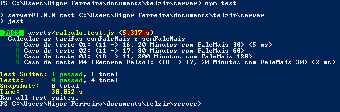
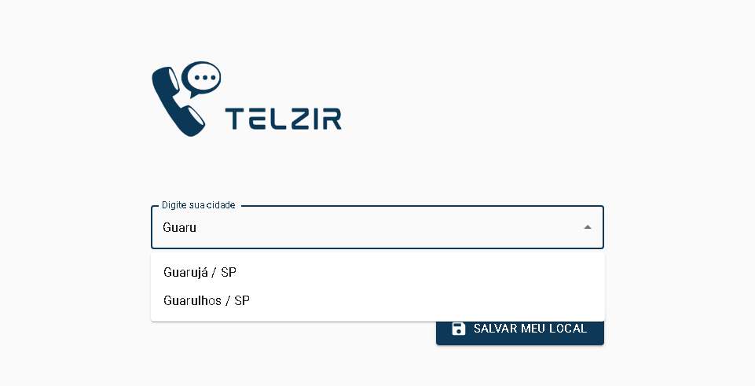
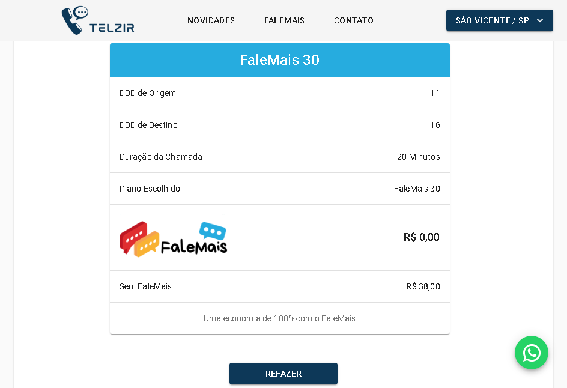

# Projeto Telzir Telecom
> Esse projeto faz parte do "Show me the code", processo seletivo da Vizir Software Studio.

Esse projeto consiste em uma aplicação web da empresa ficticia Telzir Telecom que permite ao publico conhecer, consultar e simular as caracteristicas e principalmente o custo de ligações de longa distância utilizando o novo plano FaleMais da Telzir.

 

## Construido com

Construido com :yellow_heart: usando as tecnologias:

#### Front-end
- ReactJS,
- JSS,
- Material-UI,
- Axios

#### Back-end
- Node.js,
- Express,
- Cors

#### Testes
- Jest

#### Deploy
- Github
- Vercel
- Heroku

## Executar a Aplicação

#### Live Version:
Você pode rodar nossa versão em nuvem em qualquer dispositivo com acesso a internet clicando [aqui](https://telzir.vercel.app/).

### Local Host:
Também é possível rodar essa aplicação localmente em um computador ou notebook, para isso é necessário ter alguns programas instalados:

#### Node.js e NPM

É necessário instalar o node e npm(ou yarn) para rodar essa aplicação localmente. Para verificar se já tem instalado, execulte em seu terminal os seguintes comandos:
```sh
node -v
```
```sh
npm -v
```
Caso o retorno de algum dos dois comandos sejam um erro, é necessário instalar o Node.js e o NPM.

##### Guias para download e instalação do Node.js e NPM:
Para download: acesse o [site oficial](https://nodejs.org/en/) do Node.js e siga o passo a passo.

Com o Node.js e NPM instalados corretamente, abra o seu terminal na pasta do projeto e  execute os seguintes comandos:

Acesse a pasta server:
```sh
cd server
```
Inicie o servidor:
```sh
npm start
```
Em outro Terminal, execulte o que segue.
Acesse a pasta web:
```sh
cd web
```
Inicie o serviço web:
```sh
npm start
```

## Executar restes automatizados

Em outro terminal dentro da pasta do projeto acesse a pasta server:
```sh
cd server
```
Execute o seguinte comando para rodar os testes:
```sh
npm test
```

O resultado esperado é concluir os quatro testes com sucesso.



Após executar esses comandos, caso tudo esteja correto, o servidor back-end estará rodando em http://localhost:3333 e o servidor front-end estará rodando em http://localhost:3000.

## Exemplo de uso

### Informe sua localidade
Inicialmente o sistema pedirá que informe sua localidade, basta digitar ou selecionar uma das opções de cidade na área de coberturar que se encontra no campo de texto e clicar em `Salvar Meu Local`.



### Simulando o custo das ligações com o FaleMais
#### Informando os dados
Role a página até chegar em 'Simulador FaleMais Telzir', ou clique no link 'FaleMais' que se encontra no menu superior.
Para utilizar essa funcionalidade basta preencher os campos do formulário escolhendo o DDD de origem e o DDD de destino; digitando a duração da ligação (em minutos) e selecionando um dos planos disponiveis.
Em seguida clique em `SIMULAR` e aguarde a resposta ser carregada.


#### Consultando a resposta
Após o carregamento, será exibida automaticamente uma tabela contendo os resultados da simulação e o percentual de vantagem em adiquirir o novo plano FaleMais da Telzir.



#### Refazendo a simulação
Para fazer uma nova consulta não é necessário recarregar ou atualizar a página, basta clicar no botão `REFAZER` que você será redirecionado de volta  ao formulário já preenchido com os dados adicionados anteriormente, basta corrigir os valores e clicar novamente em `SIMULAR`.

------------
#### Importante!
No formulário de simulação não é permitido:

 `1 - Deixar qualquer campo em branco,`
 `2 - Utilizar o mesmo DDD para Origem e Destino`
 `3 - Não utilizar o DDD '11' nem para origem, nem para destino.`

Caso isso ocorra, você receberá um alerta de erro como esse:


Basta seguir os requisitos corretamente para ter sucesso na simulação.

------------

## Entre em contato comigo

Higor Moroni – [WhatsApp](https://api.whatsapp.com/send?phone=5513988685814) – moroni@higor.tech

[Github](https://github.com/HigorMoroni/) - [Linkedin](https://www.linkedin.com/in/higormoroni/) - [Portfólio](https://higor.tech).
